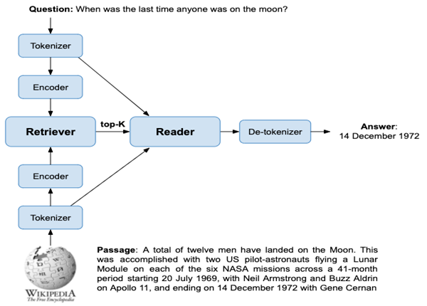
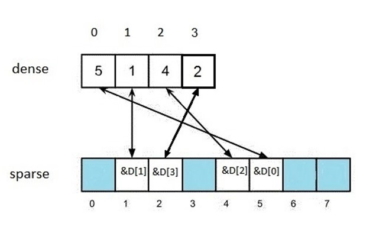
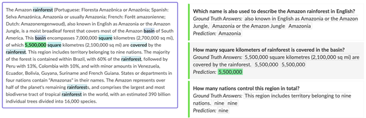

# Exploring the State-of-the-Art of Question Answering Systems

## Introduction

_&quot;Hi Siri, can you find me a pizzeria?&quot;_ – this is an example of Conversation AI in action. It has become a buzzword with the advent of increasingly more powerful computing power to process huge amounts of data, breakthroughs in Artificial Intelligence (AI) and the adoption of mobile devices offering speech input with Apple&#39;s Siri, Amazon&#39;s Alexa, IBM&#39;s Watson Assistant or Google Home. Conversation AI can improve our access to information by making it easier and faster to interact with online systems, either by text or speech. For example, IBM’s Watson question-answering system won the TV game-show Jeopardy! by beating humans at answering questions in 2011.

The goal here is to demystify and explain what Conversation AI is, and then I will focus on a particular type of Conversation AI system called Question Answering (QA). I will explore the state-of-art of a QA system by explaining the basics of the architecture of such system built by different technologies by going through existing sample implementations.

## What is Conversational AI?

Conversation AI allow easy access to various services and information via conversation and fundamental to natural user interfaces. These user interfaces can be [text based, but also voiced based](https://www.uxmatters.com/mt/archives/2021/01/why-mobile-apps-need-voice-interfaces.php) with the [increasing use](https://www.statista.com/statistics/277125/share-of-website-traffic-coming-from-mobile-devices/) of mobile devices. There have been publicly available conversational systems going back many decades. For example, the precursors of today&#39;s chatbot systems relied heavily on hand-crafted rules and are very different from the data-driven conversational AI systems of today. We see that breakthroughs in deep learning (DL) and reinforcement learning (RL) are applied to conversational AI. There are [three categories of conversation AI](https://arxiv.org/abs/1809.08267): (1) chatbots, (2) task-oriented dialogue agents, and (3) question answering (QA) agents.

First, a **chatbot** is an agent that needs to converse seamlessly and appropriately with users — like a human as in the Turing test — and provide useful recommendations. Examples include personal assistants like Amazon&#39;s Alexa, Google Assistant, Facebook M, and Microsoft&#39;s Cortana, which in addition to personal assistant skills can handle chitchat user inputs. They are used for customer support by replacing human agents along the customer journey by answering frequently asked questions (FAQs) or offering recommendations.

Second, **task-oriented dialogue** systems nowadays often reside in smart phones, smart speakers and personal computers. They can perform a range of tasks or services for a user and are sometimes referred to as virtual assistants or intelligent personal assistants. Some of the example services are providing weather information, setting alarms, and call-center support.

Finally, and the focus here, **QA** systems provide concise, direct answers to user queries based on rich knowledge drawn from various data sources including text collections such as Web documents and pre-compiled knowledge bases such as sales and marketing datasets. Search engine companies, including Google, Microsoft and Baidu, have incorporated QA capabilities into their search engines to make user experience more conversational, which is particularly appealing for mobile devices. Instead of returning ten blue links, the search engine generates a direct answer to a user query.

## Theory Behind Open-Domain Question Answering Systems

The first question answering systems built by Natural Language Processing (NLP) researchers were highly domain specific.  They were not helpful beyond the domains they were built for. In other words, they are _closed domain_ _and did not have access to an external source of information_. In open-domain QA (also known as _reading comprehension_ when the context of a question is known), the questions are not limited to predefined domains and domain knowledge; ideally, the system should be able to sift through a very large amount of text documents to find the answer for us. This is called factoid open-domain QA, but there is also [long-form QA](https://ai.googleblog.com/2021/03/progress-and-challenges-in-long-form.html) to retrieve a paragraph-length answer for answering _why_ questions, which is more difficult. In the remainder of this post, I focus on open-domain factoid QA here, since for this use-case we have effective technologies readily available. QA is an _information retrieval_ (IR) problem and can be solved with a search engine, but there is also a knowledge-based (KB) approach where data is transformed into triplets and the answer is found within the graph. This [book chapter](https://web.stanford.edu/~jurafsky/slp3/23.pdf) and [this article](https://lilianweng.github.io/lil-log/2020/10/29/open-domain-question-answering.html) present the theory behind QA more in detail.

Search engines traditionally return a list of results consisting of documents (SERP) given a query expressed with keywords. Nowadays, search engines like Google have added QA functionality to their search engines where answers are returned directly. See this example in Figure 1, where Google returned the answer directly for the query expression in a natural language question.

How does such a QA system typically work? Search engines like Google, Bing or Baidu use the information retrieval (IR) approach, where the power of a search engine to retrieve relevant information comes from an index. This index can consist of sentences, paragraphs, or entire documents.The common approach to build a QA system is a retriever-reader approach and consists of 2 steps:

1. **Retriever** : find the related context in an external repository of knowledge.
2. **Reader** : Process the retrieved context to _extract_ an answer.

### Retriever

The _**retriever**_ is responsible for generating a set of candidate passages. Since the subsequent reader component is expensive to evaluate given the amount of data, it is crucial to have an effective retrieval mechanism. There are two main approaches to retrieval: term-based (sparse) such as for BM25 and embedding (dense) vectors (also called encodings). What happens is that symbolic representations, such as words, emojis, categorical items, etc are [converted into meaningful numbers](https://medium.com/@b.terryjack/nlp-everything-about-word-embeddings-9ea21f51ccfe). An embedding vector model represents a word as a dense numeric vector. These vectors aim to capture semantic properties of the word, so that words whose vectors are close together should be similar in terms of semantic meaning.

- **Term-based vectors** are sparse with 1 dimension (present or not in a document regarded as _a bag of words_), can comprise 50,000+ dimensions. Since most documents contain only a small subset of the full vocabulary, these vectors are considered sparse since non-zero values are plentiful.

- **Embedding vectors** are dense because they are relatively low-dimensional, often ranging from 100 to 1,000 dimensions. Individual dimensions are not mapped to any corresponding vocabulary or linguistic feature, but each dimension encodes some information about the text. There are rarely 0s in these vectors hence their relative density.

The similarity between a query and a passage can be defined as the dot product of their vectors. But the question and answer may not have the same words, which is called the _vocabulary mismatch problem_. [For example](https://0x65.dev/blog/2019-12-07/indexing-billions-of-text-vectors.html),
* the queries _opening a restaurant in munich_ and _best restaurant of munich_ are similar because they share the words _restaurant_ and _munich_,

* whereas _best restaurant of munich_ and _where to eat in munich_ are less similar because they only share a single word.

Someone looking for a restaurant in Munich will however likely be better served by considering the second pair of queries to be similar. This is where dense vector-based matching becomes useful.

In order to support the matching of the dense vectors, these vectors need to be trained. This can be done with for example Word2vec using the Cosine similarity ([illustrative explanation can be found here](https://jalammar.github.io/illustrated-word2vec/)), BERT ([example with a Jupyter notebook](https://towardsdatascience.com/nlp-extract-contextualized-word-embeddings-from-bert-keras-tf-67ef29f60a7b)), etc. Another possibility is to use pre-training embeddings like [GloVe](https://nlp.stanford.edu/projects/glove/) by Stanford University.

Once we have indexed the vectors of a document, we can match on dense vectors (of the query and the documents) using Approximate Nearest Neighbor (ANN) using a [Hierarchical Navigable Small World (HNSW) index](https://arxiv.org/abs/1603.09320), which is fully graph-based. This [blog post tested](https://medium.com/vespa/approximate-nearest-neighbor-search-in-vespa-part-1-36be5f43b8d1) the different algorithms to implement ANN search and found that the HNSW approach has best search performance in terms of query throughput, but has worst indexing performance.

Historically, term-based retrieval has outperformed semantic embeddings on question answering problems. However, this [paper](https://arxiv.org/pdf/2004.04906.pdf) shows that dense retrieval can be vastly improved by 9%-19% in terms of top-20 passage retrieval accuracy compared to the term-based approach if the encoding has specifically been trained to the task, an approach called Dense Passage Retrieval (DPR). The source code to build this model [is available here](https://github.com/facebookresearch/DPR). An advantage of using embedding vectors is that semantic similar words are matched, but it is computational more expensive, requires an initial training of a model and is language specific. An advantage of using a term-based approach is that it is fast and simple, but it relies on keyword matching which could reduce the accuracy.

### Reader
The _**reader**_ extracts the passages&#39; actual answer. This requires some form of natural language understanding model. The state-of-the-art is to use _Bidirectional Encoder Representations from Transformers_ or BERT (or other Transformer) models. The Transformer is a deep learning model that weighs different parts of the input data. BERT is a Transformer-based technique for NLP pre-training developed by Google and offering in a format called [ONNX](https://onnx.ai/) and published in the [HuggingFace](https://huggingface.co/) repository. Pre-trained models can be plugged into downstream systems, but it can be helpful to adjust the model to fit the specific target dataset and task.

These models are typically huge and expensive to evaluate. Therefore, so called passages (or fragments) are extracted from the documents and indexed and returned by the Retriever as input for the Transformer, besides the query. So only a small number of candidate passages are run through a model such as BERT. The Reader can re-rank the top results returned by the Retriever.

To extract the final answer, the passage that produced the highest relevance score is used. The two other outputs of the model are probabilities for each token of being a start token and an end token. The final answer is chosen by finding the span with the largest sum of start probability and end probability. This results in a sequence of tokens, which must be converted to words by the tokenizer before returning the answer.

## Putting it into Practise

There are different approaches to put this theory into practise. The following examples describe how (a part of) a QA system can be built, including links to the source code on Github.

* This [blogpost describes](https://towardsdatascience.com/building-an-application-of-question-answering-system-from-scratch-2dfc53f760aa) an approach with BM25 in the Retriever step using the MediaWiki API (based on Elasticsearch), while using BERT (as a service) in the Reader step.

* [This Jupyter Notebook](https://colab.research.google.com/github/deepset-ai/haystack/blob/master/tutorials/Tutorial6_Better_Retrieval_via_DPR.ipynb) tutorial shows the steps to build a Retriever with DPR and a SQL database and a Reader with BERT.

* This [blog post by Elastic](https://www.elastic.co/blog/text-similarity-search-with-vectors-in-elasticsearch) describes how dense vector embeddings can be used and the Retriever step of a QA system can be implemented with Elasticsearch as part of their commercial offering called X-Pack.

* This post shows retrieval can be made faster and [describes performance benchmarks](https://towardsdatascience.com/speeding-up-bert-search-in-elasticsearch-750f1f34f455) of KNN search with several open-source solutions. The [KNN plugin of OpenDistro](https://opendistro.github.io/for-elasticsearch/blog/odfe-updates/2020/04/Building-k-Nearest-Neighbor-(k-NN)-Similarity-Search-Engine-with-Elasticsearch/) (now called OpenSearch) is the best performing open-source ANN implementation in this test.

* Another [blog post by Vespa](https://blog.vespa.ai/efficient-open-domain-question-answering-on-vespa/) describes how both the Retriever and Reader steps can be implemented for in production using Wikipedia data, but it uses prepared data of Facebook Research. Vespa calls itself an open-source big data serving engine. Here we see that the data has been pre-processed by tokenizing it into snippets and the passage embeddings have been pre-computed with DPR. It results in a document like this being indexed:

        {
          "put": "id:wiki:wiki::41",
          "fields": {
            "title": "Alcohol",
            "text": "Alcohol In chemistry, an alcohol is any organic compound in which the hydroxyl functional group is bound to a carbon. ...",
            "id": 41,
            "text_embedding": {"values": [0.030272305011749268, ...]}
          }
        }

  It then uses these fields for either BM25 retrieval with the _text_ and _title_ fields or dense retrieval with the _text\_embedding_ field using ANN or a hybrid form of both. Their results show that the Retriever accuracy is highest using purely dense retrieval. Vespa allows for building the HNSW index online as data is indexed, so there is no need to build such an index offline.

  The sample application provides a small dataset of 100 documents to try it out on a laptop. However, to index the whole dataset, which consists of 273G of these documents, it requires a single content node instance with 36 vCPU&#39;s and minimum 128GB system memory. This takes about 5 hours, but it should be possible to [run this on multiple nodes](https://docs.vespa.ai/documentation/performance/sizing-examples.html).

## Conclusion
I have explained what Conversation AI is and narrowed down on the state-of-the-art of open-domain QA, described how such a system works, and finally some of its implementations. Conversation AI has been adopted and will increasingly be more adopted by industry. The technologies that support this are available and open source. The &quot;time to market&quot; is improving, because the technologies are evolving with continuous research and benchmarking of old and new models, resulting in more accurate and better performing systems readily to be deployed in the real world.

## Acknowledgements
This work is supported by **Optimizely**. We unlock digital potential. Optimizely creates digital experiences that transform your company to take data-driven decisions, continued experimentation and constant invention. See https://www.optimizely.com/ and we [are hiring](https://www.optimizely.com/careers/)!

## References
- [Jurafsky, D., & Martin, J. H. (2019). Speech and language processing: An introduction to natural language processing, computational linguistics, and speech recognition.](https://web.stanford.edu/~jurafsky/slp3/)
- [arXiv:1809.08267](https://arxiv.org/abs/1809.08267)
- [arXiv:2004.04906](https://arxiv.org/abs/2004.04906)
- [arXiv:1603.09320](https://arxiv.org/abs/1603.09320)
- http://ai.stanford.edu/blog/answering-complex-questions/
- [https://lilianweng.github.io/lil-log/2020/10/29/open-domain-question-answering.html](https://lilianweng.github.io/lil-log/2020/10/29/open-domain-question-answering.html)
- [https://colab.research.google.com/github/deepset-ai/haystack/blob/master/tutorials/Tutorial6\_Better\_Retrieval\_via\_DPR.ipynb](https://colab.research.google.com/github/deepset-ai/haystack/blob/master/tutorials/Tutorial6_Better_Retrieval_via_DPR.ipynb)
- https://docs.vespa.ai/en/nearest-neighbor-search.html
- [https://github.com/vespa-engine/sample-apps/tree/master/dense-passage-retrieval-with-ann](https://github.com/vespa-engine/sample-apps/tree/master/dense-passage-retrieval-with-ann)
- [https://blog.vespa.ai/efficient-open-domain-question-answering-on-vespa/](https://blog.vespa.ai/efficient-open-domain-question-answering-on-vespa/)
